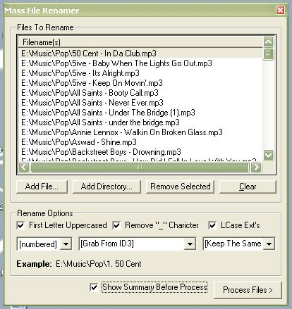



## MFR \- Mass File Renamer

### Description

Lets you rename mass amout of files in a flash! u can customise the new filenames with numbers and it can also grab id3 tags from mp3 files making things that much easier. Please Vote :p
 
### More Info
 

             |
---                |---
**Submitted On**   |2003-10-28 02:44:36
**By**             |[Aimee Bailey](https://github.com/Planet-Source-Code/PSCIndex/blob/master/ByAuthor/aimee-bailey.md)
**Level**          |Intermediate
**User Rating**    |5.0 (10 globes from 2 users)
**Compatibility**  |VB 6\.0
**Category**       |[Files/ File Controls/ Input/ Output](https://github.com/Planet-Source-Code/PSCIndex/blob/master/ByCategory/files-file-controls-input-output__1-3.md)
**World**          |[Visual Basic](https://github.com/Planet-Source-Code/PSCIndex/blob/master/ByWorld/visual-basic.md)
**Archive File**   |[MFR\_\-\_Mass16641510282003\.zip](https://github.com/Planet-Source-Code/aimee-bailey-mfr-mass-file-renamer__1-49487/archive/master.zip)

